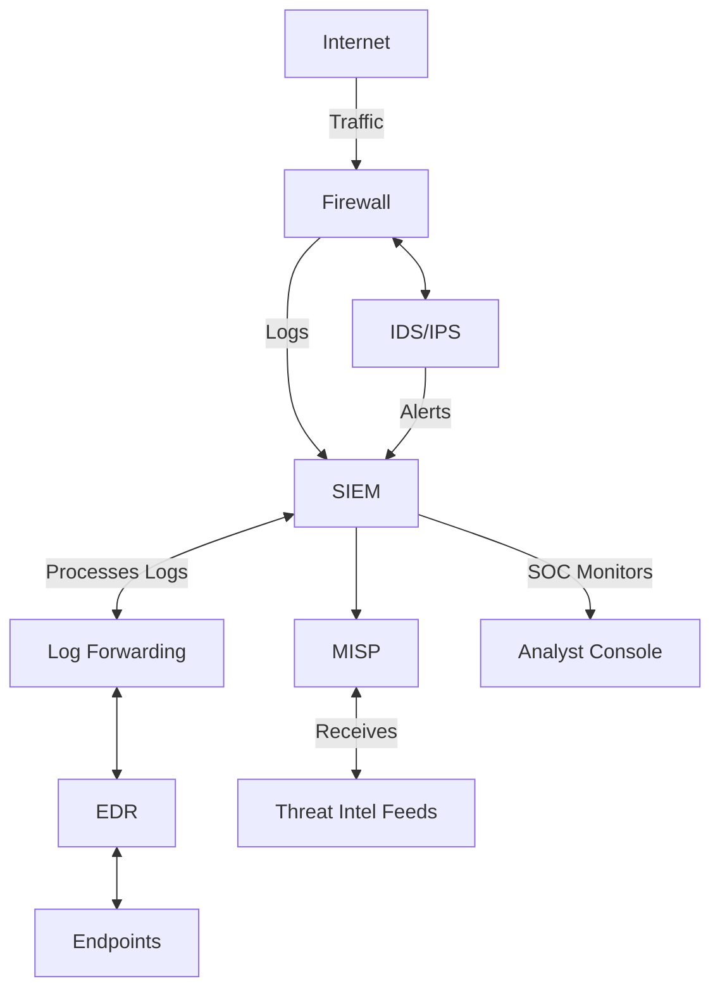

# Collaborative Threat Defense: Tools Working Together in a SOC

A Security Operations Center (SOC) serves as the nerve center for an organization’s cybersecurity operations, orchestrating a symphony of tools to detect, analyze, respond to, and mitigate threats. The integration of tools like **Security Information and Event Management (SIEM)**, **Endpoint Detection and Response (EDR)**, **Malware Information Sharing Platform (MISP)**, **Intrusion Detection/Prevention Systems (IDS/IPS)**, and **Firewalls** is critical to achieving a cohesive defense-in-depth strategy. This blog explores how these tools work together within a SOC, their individual roles, and the technical mechanisms enabling their collaboration.

---

## 1. Overview of SOC Tools and Their Roles

- **SIEM (Security Information and Event Management)**  
  SIEM acts as the central brain of the SOC, aggregating logs and events from various sources (e.g., servers, applications, network devices) for real-time analysis, correlation, and alerting. It provides long-term storage for compliance and forensic investigations, leveraging rules and machine learning to detect anomalies or known attack patterns.

- **EDR (Endpoint Detection and Response)**  
  EDR focuses on endpoints (e.g., workstations, servers), offering real-time monitoring, threat detection, and response capabilities. It collects detailed telemetry (e.g., process execution, file modifications) and enables incident responders to investigate and contain threats at the endpoint level.

- **MISP (Malware Information Sharing Platform)**  
  MISP is a threat intelligence platform that facilitates the sharing and storage of Indicators of Compromise (IoCs) such as IP addresses, hashes, and domains. It supports collaboration between SOC teams and external entities (e.g., ISACs, CERTs) to enrich threat context.

- **IDS/IPS (Intrusion Detection/Prevention Systems)**  
  IDS monitors network traffic for suspicious activity based on signatures or behavioral analysis, while IPS extends this by actively blocking malicious traffic. These tools are typically deployed at network choke points (e.g., gateways).

- **Firewall**  
  Firewalls enforce network security policies by filtering traffic based on predefined rules (e.g., IP, port, protocol). Next-Generation Firewalls (NGFWs) add deep packet inspection (DPI) and application-layer filtering.

---

## 2. Integration Mechanisms

The seamless collaboration of these tools relies on standardized protocols, APIs, and data-sharing frameworks. Below are the key integration mechanisms:

- **Log and Event Forwarding**  
  Tools like Firewalls, IDS/IPS, and EDR generate logs in formats such as Syslog, JSON, or CEF (Common Event Format). These logs are forwarded to the SIEM via agents (e.g., Beats, Fluentd) or direct connectors for centralized analysis.

- **API-Based Integration**  
  Modern tools expose RESTful APIs for bidirectional communication. For instance, SIEM can query EDR for endpoint telemetry, or MISP can push IoCs to IDS/IPS and Firewalls for real-time blocking.

- **Threat Intelligence Feeds**  
  MISP integrates with SIEM, IDS/IPS, and Firewalls by distributing structured threat intelligence (e.g., STIX/TAXII format). This allows automated updates of blocklists or detection rules.

- **Orchestration via SOAR**  
  While not explicitly listed, Security Orchestration, Automation, and Response (SOAR) platforms often bridge these tools, automating workflows (e.g., isolating an endpoint via EDR after a SIEM alert).

---

## 3. Collaborative Workflow in a SOC

Let’s walk through a typical threat detection and response scenario to illustrate how these tools collaborate:

1. **Initial Detection**  
   - A Firewall detects and logs an inbound connection attempt from a suspicious IP, forwarding the event to the SIEM.  
   - Simultaneously, an IDS identifies anomalous traffic patterns (e.g., a potential SQL injection) and sends an alert to the SIEM.

2. **Correlation and Enrichment**  
   - The SIEM correlates the Firewall and IDS logs, identifying a potential attack. It queries MISP for IoCs related to the suspicious IP and discovers it’s linked to a known ransomware campaign.  
   - SIEM enriches the alert with MISP data (e.g., malware family, TTPs) and prioritizes it for SOC analysts.

3. **Endpoint Investigation**  
   - The SIEM triggers an EDR investigation on endpoints that communicated with the suspicious IP. EDR returns telemetry showing a malicious process execution (e.g., PowerShell script).  
   - Analysts use EDR’s forensic tools to capture memory dumps and file samples for deeper analysis.

4. **Containment and Mitigation**  
   - The IPS updates its ruleset with the IoC from MISP, blocking further traffic from the malicious IP.  
   - EDR isolates the affected endpoint, preventing lateral movement.  
   - The Firewall adjusts its policies to deny outbound traffic to related C2 domains identified by MISP.

5. **Post-Incident Actions**  
   - SIEM logs the entire incident timeline for compliance and audits.  
   - MISP shares the incident’s IoCs with external partners, contributing to collective defense.

---

## 4. Technical Integration Details

- **SIEM-EDR Integration**  
  EDR platforms (e.g., CrowdStrike, SentinelOne) use APIs to send endpoint telemetry to SIEM (e.g., Splunk, Elastic). SIEM dashboards display EDR alerts, and analysts can pivot to the EDR console for response actions like killing processes or rolling back changes.

- **MISP-IDS/IPS/Firewall Integration**  
  MISP exports IoCs in formats like Snort or Suricata rules, which IDS/IPS (e.g., Snort, Zeek) ingest to enhance detection. Firewalls (e.g., Palo Alto NGFW) consume MISP feeds via dynamic blocklists updated through API calls.

- **IDS/IPS-Firewall Synergy**  
  IDS/IPS often sits inline or in parallel with the Firewall. For example, an IPS can instruct the Firewall to drop a packet if it matches a signature, reducing latency in blocking threats.

- **Data Flow Standards**  
  - **CEF/Syslog**: Used by Firewalls and IDS/IPS for logging to SIEM.  
  - **STIX/TAXII**: MISP shares structured threat intel with SIEM and IDS/IPS.  
  - **REST APIs**: Enable real-time queries and actions between tools.

---

## 5. Challenges and Best Practices

- **Challenges**  
  - **Data Overload**: SIEM can be overwhelmed by log volume from EDR and Firewalls, requiring tuning to filter noise.  
  - **Interoperability**: Legacy tools may lack API support, necessitating custom connectors.  
  - **Latency**: Real-time IoC updates from MISP to IPS/Firewall can introduce delays if not optimized.

- **Best Practices**  
  - Deploy a SOAR platform (e.g., Splunk SOAR, Demisto) to automate repetitive tasks across tools.  
  - Use centralized logging agents to standardize data formats before ingestion into SIEM.  
  - Regularly validate and update MISP feeds to ensure actionable intelligence.

---

## 6. Illustrative Block Diagram Description

Below is a textual representation of a block diagram illustrating the integration of these tools in a SOC:

### Summary of the Workflow

1. **Internet traffic flows through the Firewall** → Logs sent to SIEM.  
2. **IDS/IPS analyzes network traffic** → Alerts sent to SIEM.  
3. **SIEM collects logs** from multiple security tools and correlates them.  
4. **EDR monitors endpoints** → Sends logs to SIEM.  
5. **MISP receives threat intelligence** → Updates SIEM with IoCs.  
6. **SOC analysts review alerts in SIEM** via the Analyst Console and respond accordingly.  

## 7. Conclusion

The integration of SIEM, EDR, MISP, IDS/IPS, and Firewalls within a SOC creates a robust, multi-layered defense system. By leveraging log aggregation, threat intelligence, network monitoring, and endpoint visibility, these tools collectively enable proactive threat detection and rapid incident response. The key to success lies in seamless data sharing, automation, and continuous tuning to adapt to evolving threats.
